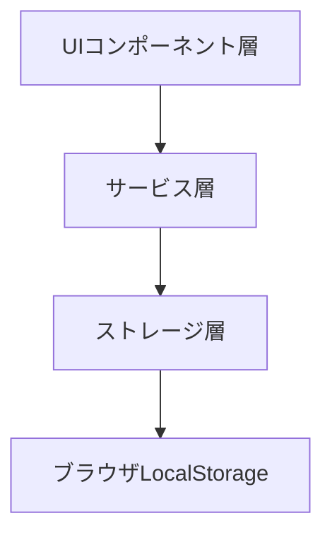
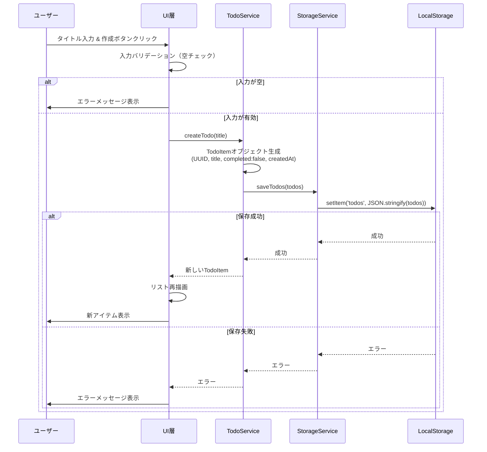
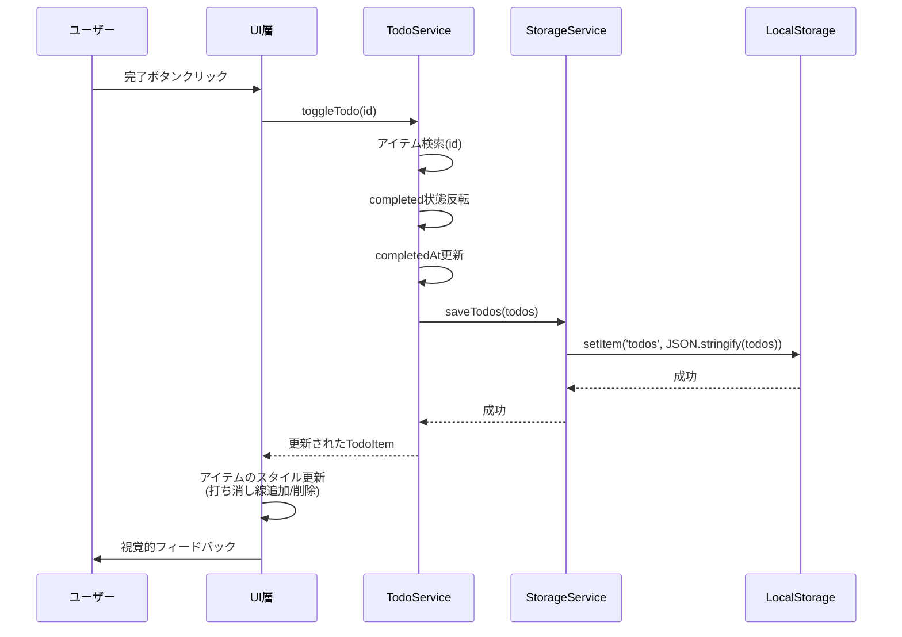
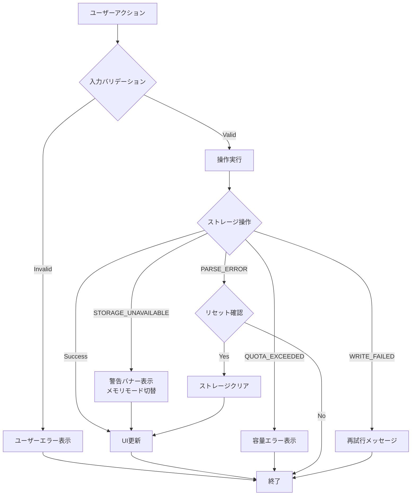

# 技術設計ドキュメント

## Overview

**目的**: このTODOアプリは、ユーザーがタスクを効率的に作成・管理・追跡できる基本的なタスク管理機能を提供します。

**ユーザー**: エンドユーザーは、日々のタスクを記録し、完了状態を管理し、不要なタスクを削除することができます。

**影響**: 新規アプリケーションとして、ブラウザベースのシンプルなTODOリストアプリを実装します。

### Goals

- ユーザーがタスクを直感的に作成・表示・管理できるシンプルなUI
- ブラウザを閉じてもデータが永続化されるローカルストレージベースのデータ管理
- タスクの完了状態を明確に視覚化し、進捗を追跡可能にする
- レスポンシブで軽量なフロントエンドアプリケーション

### Non-Goals

- ユーザー認証・マルチユーザー対応（シングルユーザーローカルアプリ）
- クラウド同期・バックエンドAPI連携
- 高度な機能（タスクの優先度、カテゴリ、期限、リマインダー）
- モバイルアプリ（ブラウザベースのみ）

## Architecture

### High-Level Architecture



このアプリケーションは、シンプルな3層アーキテクチャを採用します：

- **UIコンポーネント層**: ユーザーインターフェースの描画とイベント処理
- **サービス層**: ビジネスロジックとデータ操作
- **ストレージ層**: ブラウザのLocalStorageへのデータ永続化

### Technology Stack and Design Decisions

#### Frontend
- **選択**: Vanilla JavaScript (ES6+) + HTML5 + CSS3
- **理由**:
  - シンプルな機能要件に対してフレームワークは過剰
  - 学習曲線が低く、依存関係がない
  - ブラウザネイティブ機能のみで実装可能
- **代替案**: React/Vue.js（学習コストと複雑性が高い）

#### Data Storage
- **選択**: Browser LocalStorage API
- **理由**:
  - 要件で指定されたローカルデータ永続化に最適
  - シンプルなkey-value APIで実装が容易
  - すべてのモダンブラウザでサポート
- **代替案**: IndexedDB（より複雑な構造化データ向け、今回は不要）

#### Architecture Pattern
- **選択**: MV* (Model-View-Service) パターン
- **理由**:
  - UI、ロジック、データの明確な分離
  - テスタビリティが高い
  - 小規模アプリに適したシンプルさ
- **代替案**: MVVMやFluxパターン（フレームワーク依存、過剰設計）

### Key Design Decisions

#### Decision 1: クライアントサイドレンダリング

**Decision**: すべてのUIをJavaScriptで動的に生成・更新する

**Context**: TODOアイテムのリストは動的に変化し、リアルタイムなUI更新が必要

**Alternatives**:
- サーバーサイドレンダリング: バックエンド不要の要件と矛盾
- テンプレートエンジン: 追加ライブラリが不要な規模

**Selected Approach**:
- DOMを直接操作してTODOアイテムを描画
- イベントリスナーでユーザー操作を処理
- 状態変更時にUIを再描画

**Rationale**:
- 依存関係ゼロでシンプル
- ブラウザネイティブAPIのみ使用
- パフォーマンス十分（数百アイテム程度まで）

**Trade-offs**:
- 獲得: シンプルさ、軽量性、依存関係なし
- 犠牲: 大規模データでの最適化、複雑なUI状態管理

#### Decision 2: 同期的なLocalStorage操作

**Decision**: すべてのデータ操作を同期的に実行し、即座にLocalStorageに反映

**Context**: ユーザーのアクション（作成・完了・削除）は即座にデータに反映される必要がある

**Alternatives**:
- バッチ更新: 一定間隔でまとめて保存
- 非同期キュー: Promise/async-awaitで保存

**Selected Approach**:
- アクション発生時に即座にLocalStorage.setItem()を呼び出し
- エラー処理でユーザーに即座にフィードバック

**Rationale**:
- LocalStorageは同期APIであり、パフォーマンス十分
- データ損失リスクを最小化
- 実装がシンプル

**Trade-offs**:
- 獲得: データ一貫性、シンプルなエラー処理
- 犠牲: 頻繁な書き込み時の若干のパフォーマンス低下（実用上問題なし）

#### Decision 3: UUIDベースのアイテム識別

**Decision**: 各TODOアイテムにUUID v4を使用

**Context**: アイテムを一意に識別し、削除・更新操作を正確に実行する必要がある

**Alternatives**:
- 連番ID: シンプルだが削除時に再採番が必要
- タイムスタンプ: 衝突の可能性
- 配列インデックス: 削除時に不安定

**Selected Approach**:
- crypto.randomUUID()でUUID v4を生成
- アイテムの一意キーとして使用

**Rationale**:
- 衝突リスクがゼロに近い
- ブラウザネイティブAPI（polyfill不要）
- 削除・並び替えに強い

**Trade-offs**:
- 獲得: 安定した識別子、拡張性
- 犠牲: わずかにメモリ使用量増加（実用上無視可能）

## System Flows

### TODOアイテム作成フロー



### TODOアイテム完了トグルフロー



## Requirements Traceability

| Requirement | 要件概要 | コンポーネント | インターフェース | フロー |
|-------------|---------|--------------|----------------|--------|
| 1.1 | タイトル入力してアイテム作成 | TodoService, UIComponent | createTodo() | 作成フロー |
| 1.2 | 空タイトルでエラー表示 | UIComponent | validateInput() | 作成フロー |
| 1.3 | 未完了状態で保存 | TodoService | createTodo() | 作成フロー |
| 1.4 | 作成日時の自動記録 | TodoService | createTodo() | 作成フロー |
| 2.1 | すべてのアイテムをリスト表示 | UIComponent, TodoService | getAllTodos(), renderTodoList() | - |
| 2.2 | タイトルと完了状態を表示 | UIComponent | renderTodoItem() | - |
| 2.3 | 未完了と完了済みを視覚的に区別 | UIComponent | renderTodoItem() | - |
| 2.4 | 空リストでメッセージ表示 | UIComponent | renderTodoList() | - |
| 3.1 | 完了ボタンで状態変更 | TodoService | toggleTodo() | 完了トグルフロー |
| 3.2 | 完了マーク適用 | UIComponent | renderTodoItem() | 完了トグルフロー |
| 3.3 | 完了済みを未完了に戻す | TodoService | toggleTodo() | 完了トグルフロー |
| 3.4 | 完了日時を記録 | TodoService | toggleTodo() | 完了トグルフロー |
| 4.1 | 削除ボタンでアイテム削除 | TodoService | deleteTodo() | - |
| 4.2 | 削除を即座にUIから除去 | UIComponent | renderTodoList() | - |
| 4.3 | 完了状態でも削除可能 | TodoService | deleteTodo() | - |
| 4.4 | 削除は永続的（undo不可） | TodoService | deleteTodo() | - |
| 5.1 | 変更をLocalStorageに自動保存 | StorageService | saveTodos() | 全フロー |
| 5.2 | アプリ再起動時にデータ復元 | StorageService, TodoService | loadTodos() | - |
| 5.3 | 保存失敗時にエラー表示 | UIComponent | showError() | 全フロー |
| 5.4 | LocalStorage不可時に警告 | StorageService, UIComponent | checkStorageAvailable() | - |

## Components and Interfaces

### プレゼンテーション層

#### UIComponent

**Responsibility & Boundaries**
- **Primary Responsibility**: ユーザーインターフェースの描画、ユーザーイベントの処理、視覚的フィードバックの提供
- **Domain Boundary**: プレゼンテーション層のみ。ビジネスロジックは持たず、TodoServiceに委譲
- **Data Ownership**: DOM要素の管理のみ。アプリケーションデータは所有しない

**Dependencies**
- **Inbound**: なし（エントリーポイント）
- **Outbound**: TodoService（データ操作）
- **External**: Browser DOM API

**Contract Definition**

```typescript
interface UIComponent {
  // 初期化とレンダリング
  init(): void;
  renderTodoList(): void;
  renderTodoItem(todo: TodoItem): HTMLElement;

  // イベントハンドラ
  handleCreateTodo(title: string): void;
  handleToggleTodo(id: string): void;
  handleDeleteTodo(id: string): void;

  // ユーザーフィードバック
  showError(message: string): void;
  showWarning(message: string): void;
  clearMessages(): void;

  // バリデーション
  validateInput(title: string): Result<string, ValidationError>;
}

type ValidationError = {
  type: 'EMPTY_TITLE' | 'INVALID_INPUT';
  message: string;
};
```

**Preconditions**:
- DOM要素（#app, #todo-form, #todo-list等）がHTML内に存在する
- TodoServiceが初期化済み

**Postconditions**:
- ユーザーアクション後、UIが最新のデータ状態を反映
- エラー発生時、ユーザーに適切なメッセージが表示される

**Invariants**:
- 表示されるTODOリストは常にStorageの状態と同期
- 完了状態のアイテムには視覚的マーク（打ち消し線）が適用される

### ビジネスロジック層

#### TodoService

**Responsibility & Boundaries**
- **Primary Responsibility**: TODOアイテムのCRUD操作、ビジネスルールの適用、データの整合性維持
- **Domain Boundary**: TODOアイテムのライフサイクル管理
- **Data Ownership**: メモリ内のTODOアイテムリストの管理

**Dependencies**
- **Inbound**: UIComponent
- **Outbound**: StorageService
- **External**: crypto.randomUUID()

**Contract Definition**

```typescript
interface TodoService {
  // CRUD操作
  getAllTodos(): TodoItem[];
  getTodoById(id: string): TodoItem | null;
  createTodo(title: string): Result<TodoItem, CreateTodoError>;
  toggleTodo(id: string): Result<TodoItem, ToggleTodoError>;
  deleteTodo(id: string): Result<void, DeleteTodoError>;

  // 初期化
  loadTodos(): Result<void, StorageError>;
}

type CreateTodoError = {
  type: 'STORAGE_FAILED' | 'INVALID_TITLE';
  message: string;
};

type ToggleTodoError = {
  type: 'TODO_NOT_FOUND' | 'STORAGE_FAILED';
  message: string;
};

type DeleteTodoError = {
  type: 'TODO_NOT_FOUND' | 'STORAGE_FAILED';
  message: string;
};
```

**Preconditions**:
- StorageServiceが初期化済み
- createTodo: titleが非空文字列

**Postconditions**:
- すべての変更操作後、StorageServiceを通じてデータが永続化される
- エラー時はロールバックされ、一貫性が保たれる

**Invariants**:
- 各TODOアイテムは一意のUUIDを持つ
- createdAtは変更不可、completedAtは完了時のみ設定
- メモリ内のtodosリストとStorageの内容は常に同期

### データ永続化層

#### StorageService

**Responsibility & Boundaries**
- **Primary Responsibility**: LocalStorageへのデータの読み書き、シリアライズ/デシリアライズ、ストレージ可用性チェック
- **Domain Boundary**: データ永続化のみ。ビジネスロジックは持たない
- **Data Ownership**: LocalStorageへのアクセス権限

**Dependencies**
- **Inbound**: TodoService
- **Outbound**: なし
- **External**: Browser LocalStorage API

**Contract Definition**

```typescript
interface StorageService {
  // ストレージ操作
  saveTodos(todos: TodoItem[]): Result<void, StorageError>;
  loadTodos(): Result<TodoItem[], StorageError>;
  clearTodos(): Result<void, StorageError>;

  // ストレージ可用性
  checkStorageAvailable(): boolean;
}

type StorageError = {
  type: 'STORAGE_UNAVAILABLE' | 'QUOTA_EXCEEDED' | 'PARSE_ERROR' | 'WRITE_FAILED';
  message: string;
};
```

**Preconditions**:
- ブラウザがLocalStorage APIをサポート（モダンブラウザ）

**Postconditions**:
- saveTodos成功時、LocalStorageに有効なJSON文字列として保存
- loadTodos成功時、有効なTodoItem配列を返す
- エラー時は具体的なエラータイプを返す

**Invariants**:
- ストレージキーは常に`todos`を使用
- データは常にJSON形式でシリアライズ

## Data Models

### Domain Model

#### TodoItem

TODOアイテムの中核となるエンティティ。一意の識別子、タイトル、完了状態、タイムスタンプを持つ。

```typescript
interface TodoItem {
  id: string;              // UUID v4形式の一意識別子
  title: string;           // TODOアイテムのタイトル（非空）
  completed: boolean;      // 完了状態 (true: 完了, false: 未完了)
  createdAt: string;       // 作成日時 (ISO 8601形式)
  completedAt: string | null;  // 完了日時 (ISO 8601形式、未完了時はnull)
}
```

**Business Rules & Invariants**:
- `id`は生成後変更不可、システム全体で一意
- `title`は空文字列不可（作成時にバリデーション）
- `completed`がfalseの場合、`completedAt`は必ずnull
- `completed`がtrueの場合、`completedAt`は有効なISO 8601タイムスタンプ
- `createdAt`は作成時に自動設定され、変更不可

#### TodoList

TodoItemの集合を管理する集約ルート。

```typescript
type TodoList = TodoItem[];
```

**Consistency Rules**:
- リスト内のすべてのTodoItemは一意の`id`を持つ
- 削除操作は即座にリストから除去（論理削除なし）

### Physical Data Model

#### LocalStorage Schema

LocalStorageには単一のキー`todos`で全データを保存。

**Key**: `"todos"`

**Value**: JSON文字列化されたTodoItem配列

```json
[
  {
    "id": "550e8400-e29b-41d4-a716-446655440000",
    "title": "牛乳を買う",
    "completed": false,
    "createdAt": "2025-10-29T10:00:00.000Z",
    "completedAt": null
  },
  {
    "id": "6ba7b810-9dad-11d1-80b4-00c04fd430c8",
    "title": "レポートを書く",
    "completed": true,
    "createdAt": "2025-10-29T09:30:00.000Z",
    "completedAt": "2025-10-29T15:45:00.000Z"
  }
]
```

**Storage Constraints**:
- LocalStorageの最大容量: 5-10MB（ブラウザ依存）
- 1TodoItem平均サイズ: 約200バイト
- 想定最大アイテム数: 約25,000件（実用的には数百件）

**Serialization Strategy**:
- `JSON.stringify()`でシリアライズ
- `JSON.parse()`でデシリアライズ
- パース失敗時は空配列`[]`をデフォルトとして扱う

## Error Handling

### Error Strategy

このアプリケーションでは、Result型パターンを使用してエラーを明示的に処理します。すべての操作は成功時に値を、失敗時にエラー詳細を返します。

```typescript
type Result<T, E> =
  | { success: true; value: T }
  | { success: false; error: E };
```

### Error Categories and Responses

#### User Errors (入力バリデーションエラー)

**EMPTY_TITLE**
- **発生条件**: ユーザーが空のタイトルでTODOアイテムを作成しようとした
- **Response**: 入力フィールドの下に赤字でエラーメッセージ「タイトルを入力してください」を表示
- **Recovery**: ユーザーが有効なタイトルを入力するまで作成ボタンを無効化

#### System Errors (ストレージエラー)

**STORAGE_UNAVAILABLE**
- **発生条件**: LocalStorageがブラウザで無効化されているか、プライベートモードで使用不可
- **Response**: ページ上部に警告バナー「データの保存ができません。ブラウザ設定を確認してください。」
- **Recovery**: セッション中のみメモリ内でデータを保持。ページリロード時にデータ消失を警告

**QUOTA_EXCEEDED**
- **発生条件**: LocalStorageの容量制限を超えた
- **Response**: エラーメッセージ「ストレージ容量が不足しています。古いアイテムを削除してください。」
- **Recovery**: ユーザーに古いアイテムの削除を促す。保存試行を中止

**PARSE_ERROR**
- **発生条件**: LocalStorageのデータが破損していてパース不可
- **Response**: 警告メッセージ「保存データが破損しています。データをリセットしますか？」
- **Recovery**: ユーザーの確認後、LocalStorageをクリアして空のリストから再スタート

**WRITE_FAILED**
- **発生条件**: LocalStorage書き込み中の予期しないエラー
- **Response**: エラーメッセージ「データの保存に失敗しました。再試行してください。」
- **Recovery**: 前回保存成功時の状態を保持。ユーザーが再操作可能

#### Business Logic Errors

**TODO_NOT_FOUND**
- **発生条件**: 存在しないIDのTODOアイテムを操作しようとした
- **Response**: エラーメッセージ「アイテムが見つかりません。リストを更新します。」
- **Recovery**: リストを再描画して最新状態を表示

### Error Handling Flow



### Monitoring

#### Error Logging

本番環境では以下のエラー情報をconsole.error()でログ出力：
- エラータイプ
- エラーメッセージ
- タイムスタンプ
- 操作コンテキスト（作成/更新/削除/読み込み）

```javascript
console.error('[TodoApp Error]', {
  type: error.type,
  message: error.message,
  timestamp: new Date().toISOString(),
  context: 'createTodo'
});
```

#### Health Monitoring

- アプリ起動時にLocalStorage可用性をチェック
- 各操作後にストレージ容量を監視（警告閾値: 80%使用時）
- エラー発生率が高い場合、ユーザーに通知

## Testing Strategy

### Unit Tests

1. **TodoService.createTodo()**:
   - 有効なタイトルでTodoItemが正しく生成される
   - UUIDが一意に生成される
   - createdAtが正しい形式で設定される
   - 空タイトルでエラーが返される

2. **TodoService.toggleTodo()**:
   - 未完了→完了への状態変更が正しく動作
   - completedAtが設定される
   - 完了→未完了への状態変更でcompletedAtがnullになる
   - 存在しないIDでエラーが返される

3. **TodoService.deleteTodo()**:
   - 指定IDのアイテムがリストから削除される
   - 削除後のリスト長が正しい
   - 存在しないIDでエラーが返される

4. **StorageService.saveTodos()**:
   - TodoListが正しくJSON形式でLocalStorageに保存される
   - LocalStorage無効時にSTORAGE_UNAVAILABLEエラーが返される

5. **StorageService.loadTodos()**:
   - 保存されたデータが正しくTodoItem配列にパースされる
   - 破損データでPARSE_ERRORが返される
   - 空のストレージで空配列が返される

### Integration Tests

1. **作成→保存→読み込みフロー**:
   - TodoServiceでアイテム作成
   - StorageServiceで保存
   - ページリロードシミュレーション
   - 保存したアイテムが正しく復元される

2. **完了トグル→永続化フロー**:
   - アイテムの完了状態を変更
   - 変更がLocalStorageに反映される
   - リロード後も完了状態が保持される

3. **削除→永続化フロー**:
   - アイテムを削除
   - LocalStorageから削除される
   - リロード後も削除状態が保持される

4. **エラーハンドリング統合**:
   - LocalStorageを無効化
   - 操作実行
   - 適切なエラーメッセージがUIに表示される
   - メモリモードでの動作確認

5. **複数操作の連続実行**:
   - 作成→完了→削除を連続実行
   - 各操作後にストレージが正しく更新される
   - UIが常に最新状態を反映

### E2E/UI Tests

1. **TODOアイテム作成フロー**:
   - タイトル入力フィールドに文字列を入力
   - 作成ボタンをクリック
   - 新しいアイテムがリストに表示される
   - 入力フィールドがクリアされる

2. **空タイトルバリデーション**:
   - 空のタイトルで作成ボタンをクリック
   - エラーメッセージが表示される
   - アイテムが作成されない

3. **完了トグル操作**:
   - 未完了アイテムの完了ボタンをクリック
   - アイテムに打ち消し線が適用される
   - 再度クリックで打ち消し線が解除される

4. **アイテム削除操作**:
   - アイテムの削除ボタンをクリック
   - アイテムがリストから即座に消える
   - リスト件数が減少する

5. **データ永続化確認**:
   - 複数のアイテムを作成
   - ページをリロード
   - すべてのアイテムが復元される
   - 完了状態も保持される

### Performance Tests

1. **大量アイテムのレンダリング**:
   - 100件のTODOアイテムを作成
   - リスト描画が1秒以内に完了することを確認

2. **連続操作のパフォーマンス**:
   - 10件のアイテムを連続作成
   - 各操作が100ms以内に完了することを確認

3. **LocalStorage読み書き速度**:
   - 50件のアイテムをLocalStorageに保存
   - 保存・読み込みが各50ms以内に完了することを確認

4. **メモリ使用量**:
   - 500件のアイテムを作成
   - ブラウザメモリ使用量が50MB以下であることを確認
